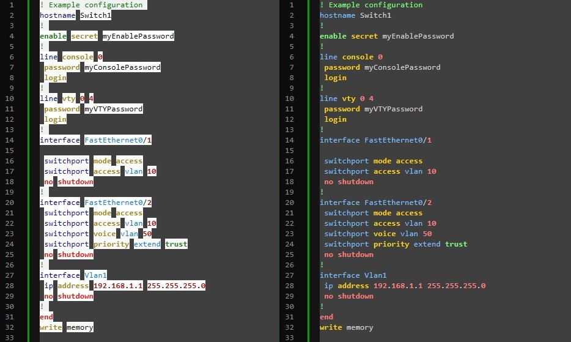
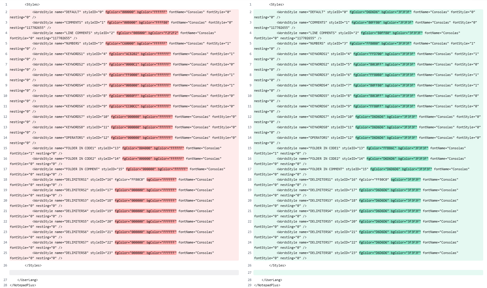

# Dark Mode Support for Cisco IOS XE Commands Syntax Highlighting in Notepad++

<br />


<br />

> This is a fork of the original Syntax Highlighting project made by [Tes3awy](https://github.com/Tes3awy). I only reskinned it. His project can be found [here](https://github.com/Tes3awy/Cisco-IOS-XE-NotepadPlusPlus-Syntax-Highlight).
> Additionally, the original files have been added to this repo fork.  

The syntax highlighting found in the original project's [.xml file](https://github.com/Tes3awy/Cisco-IOS-XE-NotepadPlusPlus-Syntax-Highlight/blob/main/Cisco_IOS_XE_byOsamaAbbas.udl.xml) is absolutely incredible. However, as someone who uses Dark Mode on every application, the color conflict was too hard to read. As a result, I revised/reskinned the original .xml file to allow for dark mode compatability / readability. 

## Revised setup instructions from the original project:
After Installing [NotePad++](https://notepad-plus-plus.org/downloads/), place the `Cisco_IOS_XE_Dark_Mode_byMicahKezar.udl.xml` file within the `%AppData%\Notepad++\userDefineLangs` folder, and restart NotePad++.

Files with extensions `.cisco`, `.ios`, `.xe`, `.log`, `.txt`, `.conf`, and `.config` will automagically use this new UDL as their default language when opened with NotePad++. Remove or add any extension when desired.

To change this behavior:

1. Open the `Cisco_IOS_XE_Dark_Mode_byMicahKezar.udl.xml` file.
2. For example, remove `txt` from the `ext` property in `<UserLang>`.

```xml
<UserLang name="Cisco IOS XE" ext="cisco ios xe log conf config" udlVersion="2.0">
```

3. Save the UDL file.
4. Restart NotePad++.

## Original Configuration vs Revised Configuration



## Specific Color Changes
The only changes I made to the original .xml was to the Hex colors. Here is the Diff Checker:  


By default, Notepad++ uses `#3F3F3F` as its Dark Mode background color. This was an easy enough change, but still left a minor issue. The rest of the original colors were too dark and hard to read. To remedy this, every color has been tweaked to increase readability.

### If you wish to completely change the colors:

1. Open the `Cisco_IOS_XE_Dark_Mode_byMicahKezar.udl.xml` file.
2. Identify the Keyword and its matching Style you want to change (Or identify the color in specific by entering random Hex numbers [here](https://htmlcolorcodes.com/) until you find the color you were looking for).
3. Use the same tool in Step 2 to pick a new favorite color, copy the Hex #, and paste the new value into the `.xml` document. 
4. Save the document and reload Notepad++.
